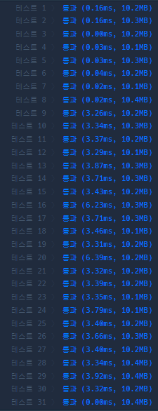

# 99클럽 코테 스터디 2일차 TIL + daily 문제

4월 17일

문제 출처 : https://school.programmers.co.kr/learn/courses/30/lessons/150365

소요 시간 : 30분

키워드 : 구현, 그리디

풀이 과정 :

    1. 처음은 갈 수 있는지 없는지 검사한다. 시작점과 도착점의 x 절댓값 차와 y 절댓값 차 만큼이 최소 이동 량으로 필요하고,
    k와 최소 이동량의 차이가 짝수여야 정확히 도착점에 도착할 수있다.

    2. 갈 수 있다는 사실이 정해지면 이제부턴 그리디하게 방향을 선택해야 한다. 사전순으로 갈 수 있다면 반드시 그 방향으로 간다.
    
    2-1. 갈 수 있음은 해당 칸으로 이동했을 때 최소 이동량이 현재 남은 k보다 작은지 검사하면 된다.

배운 점 :
    간단한 문제였는데 보통 코딩테스트에서 2차원 필드의 좌표를 (y,x) 로 많이 잡는데, 이 문제 역시 y,x의 관점에서 값을 주지만 변수 이름이 x,y라서 살짝 헷갈릴뻔 했다.
    이런 좌표나 표현 형식 문제는 문제 초반에 확실히 살피고 기준을 정한 다음 풀이를 진행하는 습관을 들여야 겠다.

